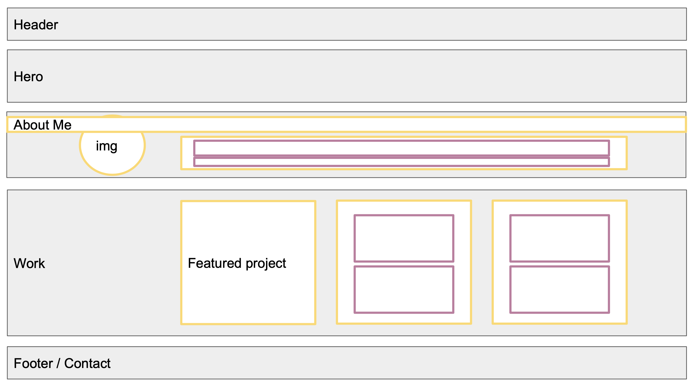
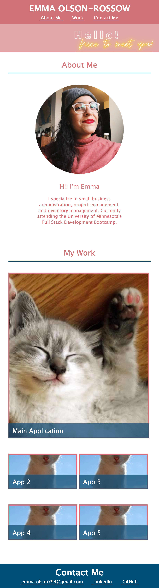

# Emma Olson-Rossow Professional Portfolio

## Purpose
The purpose of this project is to create a professional portfolio showcasing my skills and displaying a easy to navigate record of my developed & deployed applications.

This allows collaborators and potential employers to navigate through my work & learn more about me in a more user-friendly way than simply browsing through GitHub repositories. 

## Application Details

Application is optimized for the following screen sizes: 575px, 768px, and 1250px. Developed on Google Chrome (v. 99.0.4844.51)

### Technologies Used
- HTML
- CSS

### Outline of Application
- Header
    - Nav links to each section
- Hero
- About Me
    - Photo (left)
    - Text (right)
- Work
    - One large icon for the featured application
    - Smaller icons for additional applications
- Contact Me
    - Links to Linkedin, Github, email, etc. 

Initial Wireframe of Application:

### Main Files In Repository
- index.html
- style.css
- default.css
- reset.css
- mediaqueries.css

## Deployed Application:

[(Link to deployed appliation)](https://emmazart.github.io/emma-olson-rossow-portfilio/)

Screenshot of deployed application in 575px window:

